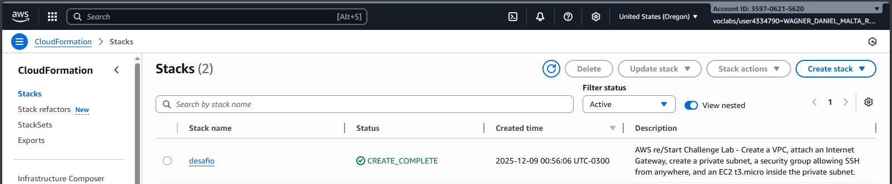
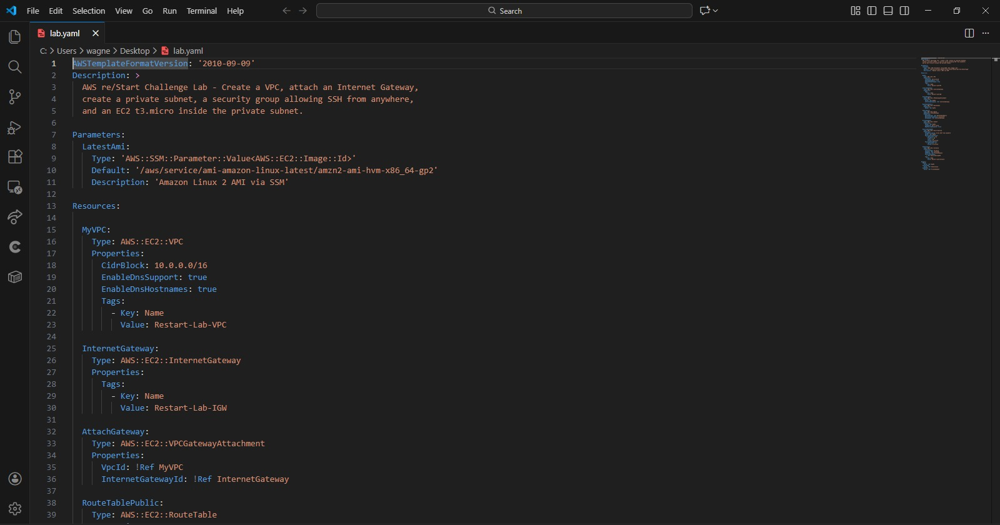
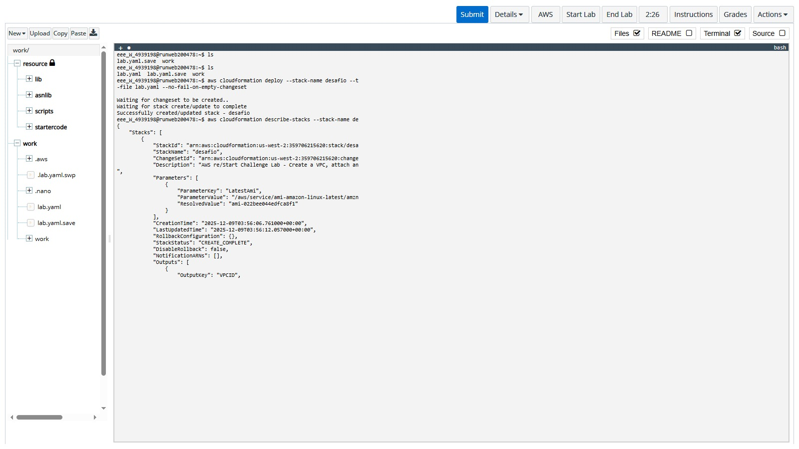

# 🗄️ aws-restart-cloudformation-challenge-lab: Desafio Completo de Infraestrutura como Código


**Documentação do desafio técnico AWS re/Start - Criação de infraestrutura com CloudFormation**

## 🎯 Desafio Completo

Implementei um template CloudFormation que cria toda a infraestrutura AWS necessária:
- ✅ VPC com CIDR 10.0.0.0/16
- ✅ Internet Gateway anexado
- ✅ Security Group permitindo SSH
- ✅ Subnet privada 10.0.1.0/24
- ✅ Instância EC2 t3.micro

## 📋 Template Executado

```yaml
AWSTemplateFormatVersion: '2010-09-09'
Description: >
  AWS re/Start Challenge Lab - Create a VPC, attach an Internet Gateway,
  create a private subnet, a security group allowing SSH from anywhere,
  and an EC2 t3.micro inside the private subnet.

Parameters:
  LatestAmi:
    Type: 'AWS::SSM::Parameter::Value<AWS::EC2::Image::Id>'
    Default: '/aws/service/ami-amazon-linux-latest/amzn2-ami-hvm-x86_64-gp2'
    Description: 'Amazon Linux 2 AMI via SSM'

Resources:

  MyVPC:
    Type: AWS::EC2::VPC
    Properties:
      CidrBlock: 10.0.0.0/16
      EnableDnsSupport: true
      EnableDnsHostnames: true
      Tags:
        - Key: Name
          Value: Restart-Lab-VPC

  InternetGateway:
    Type: AWS::EC2::InternetGateway
    Properties:
      Tags:
        - Key: Name
          Value: Restart-Lab-IGW

  AttachGateway:
    Type: AWS::EC2::VPCGatewayAttachment
    Properties:
      VpcId: !Ref MyVPC
      InternetGatewayId: !Ref InternetGateway

  RouteTablePublic:
    Type: AWS::EC2::RouteTable
    Properties:
      VpcId: !Ref MyVPC

  PublicRoute:
    Type: AWS::EC2::Route
    DependsOn: AttachGateway
    Properties:
      RouteTableId: !Ref RouteTablePublic
      DestinationCidrBlock: 0.0.0.0/0
      GatewayId: !Ref InternetGateway

  PrivateSubnet:
    Type: AWS::EC2::Subnet
    Properties:
      VpcId: !Ref MyVPC
      CidrBlock: 10.0.1.0/24
      MapPublicIpOnLaunch: false

  SecurityGroupSSH:
    Type: AWS::EC2::SecurityGroup
    Properties:
      GroupDescription: Allow SSH from anywhere
      VpcId: !Ref MyVPC
      SecurityGroupIngress:
        - IpProtocol: tcp
          FromPort: 22
          ToPort: 22
          CidrIp: 0.0.0.0/0
      SecurityGroupEgress:
        - IpProtocol: -1
          CidrIp: 0.0.0.0/0

  EC2Instance:
    Type: AWS::EC2::Instance
    Properties:
      InstanceType: t3.micro
      ImageId: !Ref LatestAmi
      SubnetId: !Ref PrivateSubnet
      SecurityGroupIds:
        - !Ref SecurityGroupSSH
      Tags:
        - Key: Name
          Value: Restart-Lab-Instance

Outputs:
  VPCID:
    Value: !Ref MyVPC
  InstanceID:
    Value: !Ref EC2Instance
  SubnetID:
    Value: !Ref PrivateSubnet
```

## 🔧 Comandos Executados

```bash
# Criar stack CloudFormation
aws cloudformation create-stack \
  --stack-name restart-challenge-lab \
  --template-body file://lab.yaml \
  --capabilities CAPABILITY_IAM

# Verificar status da stack
aws cloudformation describe-stacks --stack-name restart-challenge-lab
```

## 📊 Resultado Obtido

Stack criada com sucesso - status **CREATE_COMPLETE**:
- VPC: vpc-0a1b2c3d4e5f67890
- EC2 Instance: i-0123456789abcdef0
- Security Group: sg-0b1c2d3e4f5a6b7c8
- Subnet: subnet-0c1d2e3f4a5b6c7d8

## 📸 Evidências





## ⚡ Conceitos Importantes

**Infraestrutura como Código:** Template versionado e reutilizável  
**VPC:** Rede virtual isolada na AWS  
**Security Groups:** Firewall virtual para instâncias  
**Subnets:** Divisões lógicas da VPC  
**CloudTrail:** Serviço de auditoria e logs  

## ✅ Competências Desenvolvidas

1. **CloudFormation:** Criação de templates YAML
2. **Rede AWS:** Configuração de VPC e subnets
3. **Segurança:** Security Groups e políticas de acesso
4. **Automação:** Deploy completo via linha de comando
5. **Monitoramento:** Análise de logs CloudTrail

## 🎯 Lições Aprendidas

• Templates CloudFormation automatizam deployments  
• VPCs isolam recursos por segurança  
• Security Groups controlam acesso às instâncias  
• CloudTrail registra todas as atividades AWS  
• AWS CLI é essencial para automação  

## 📚 Recursos Úteis

| Recurso | Link |
|---------|------|
| CloudFormation Docs | [docs.aws.amazon.com/cloudformation](https://docs.aws.amazon.com/cloudformation) |
| VPC User Guide | [docs.aws.amazon.com/vpc](https://docs.aws.amazon.com/vpc) |
| AWS re/Start | [aws.amazon.com/training/restart](https://aws.amazon.com/training/restart) |
| AWS CLI | [docs.aws.amazon.com/cli](https://docs.aws.amazon.com/cli) |


